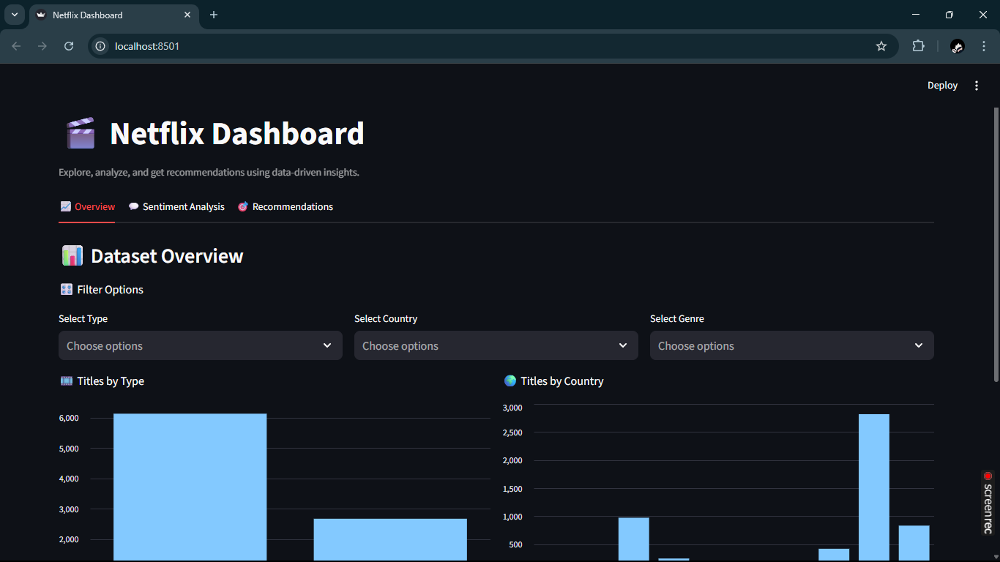
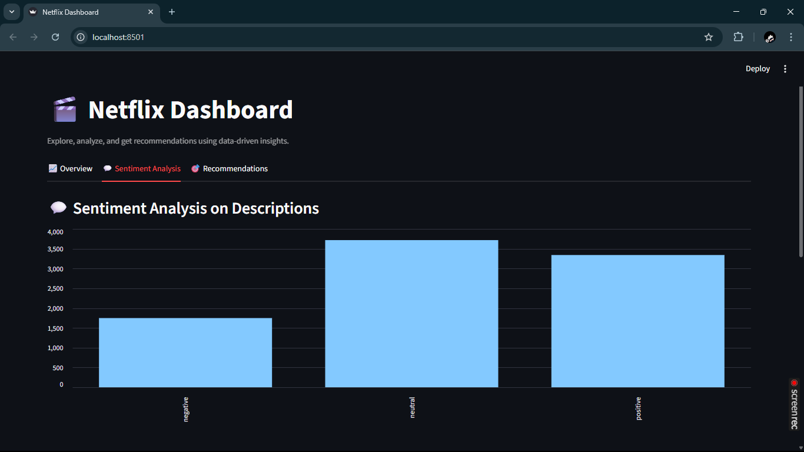
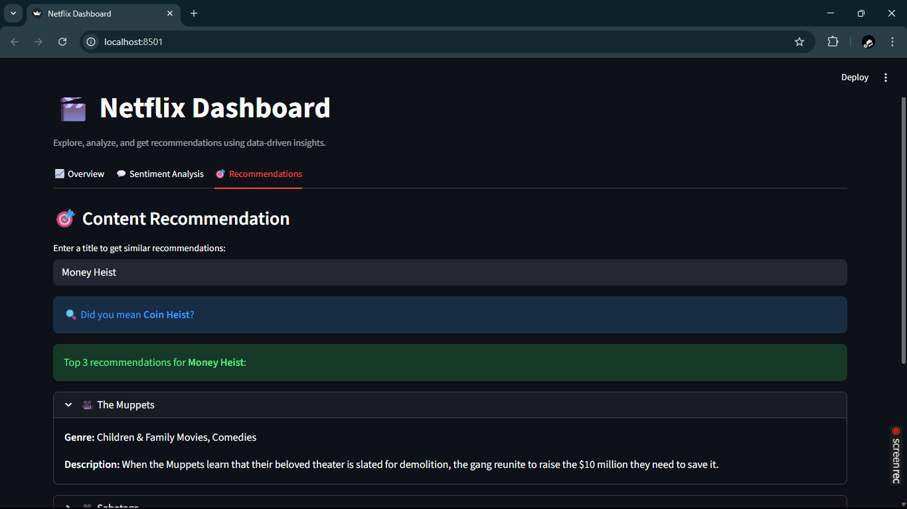

# 🎬 Netflix Dashboard

An interactive Streamlit dashboard that analyzes Netflix content data using **Data-driven insights**, including **sentiment analysis** and a **content-based recommendation engine**.

---

## 🚀 Features

### 📊 1. Dataset Overview
- Explore Netflix movies and TV shows.
- Filter by **Type**, **Country**, and **Genre**.
- Visualize content distribution using bar charts.

### 💬 2. Sentiment Analysis
- Automatic sentiment classification of show descriptions using **TextBlob**.
- View counts of positive and negative sentiments.
- Try custom text input to analyze sentiment instantly.

### 🎯 3. Recommendation Engine
- AI-based content recommender using **TF-IDF** and **cosine similarity**.
- Enter a show or movie title to get similar recommendations.
- Each recommendation displays **genre** and **description**.

---

## 🖼️ Demo Screenshots

### Overview Tab


### Sentiment Analysis Tab


### Recommendation Tab


---

## 🧠 Tech Stack

| Component | Technology |
|------------|-------------|
| **Frontend** | [Streamlit](https://streamlit.io) |
| **Data Processing** | Pandas, Scikit-learn |
| **Sentiment Analysis** | TextBlob |
| **Machine Learning** | TF-IDF Vectorization + Cosine Similarity |
| **Language** | Python 3.8+ |

---

## 🧩 Project Structure

```
netflix-ai-dashboard/
├── data/
│   └── netflix_titles.csv
├── screenshots/
│   ├── overview.png
│   ├── sentiment.png
│   └── recommendation.png
├── src/
│   ├── data_cleaning.py
│   ├── sentiment_analysis.py
│   └── recommender.py
├── app.py
├── requirements.txt
├── .gitignore
└── README.md
```

---

## ⚙️ Installation & Setup

### 1️⃣ Clone the Repository
```bash
git clone https://github.com/yourusername/netflix-dashboard.git
cd netflix-dashboard
```

### 2️⃣ Create and Activate Virtual Environment

**Windows:**
```bash
python -m venv venv
venv\Scripts\activate
```

**macOS/Linux:**
```bash
python3 -m venv venv
source venv/bin/activate
```

### 3️⃣ Install Dependencies
```bash
pip install -r requirements.txt
```

### 4️⃣ Start the Netflix AI Dashboard locally:

```bash
streamlit run netflix_dashboard.py
```

